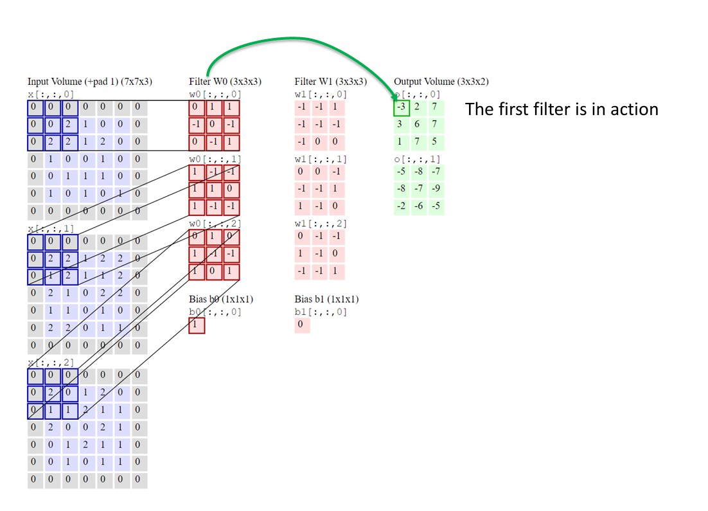
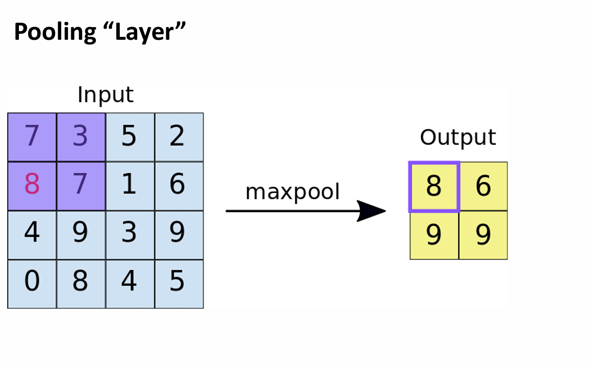
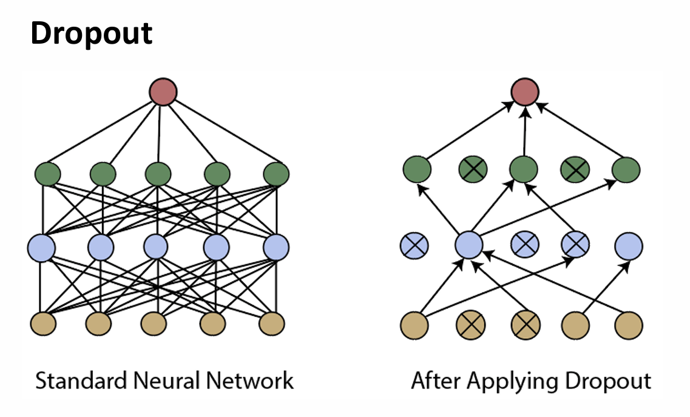
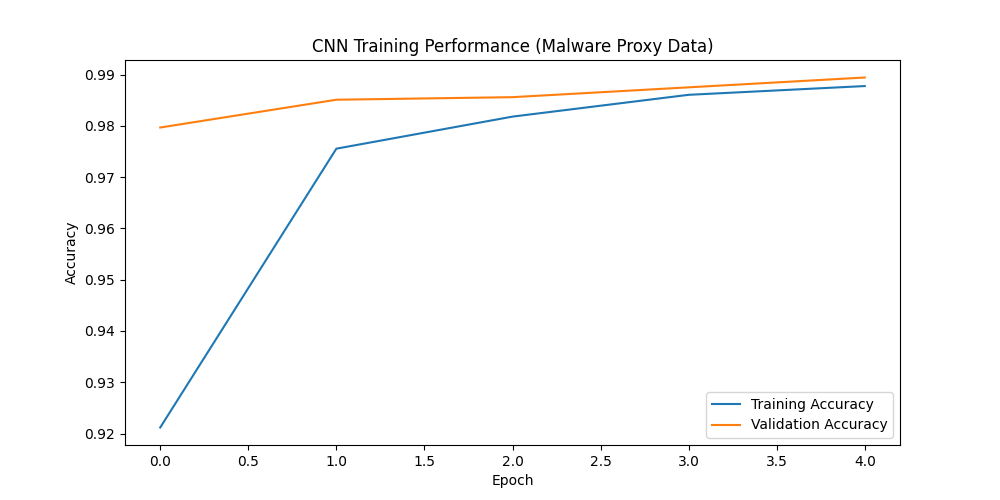

## Technical Description of Convolutional Neural Networks (CNN)

### Foundations of CNN Architecture
While traditional fully connected (dense) networks are mathematically "universal," they are computationally inefficient for high-dimensional data like images or binary feature maps. Convolutional Neural Networks (CNNs) overcome this by modeling the biological topology of the human visual system (Slides 2-6). 

Just as the human retina processes localized areas of the visual field through a chain of neurons, CNNs focus on spatial relationships. This is achieved through **Weight Sharing**, where a small matrix (the Kernel) slides across the input to detect features. This approach significantly reduces the number of parameters compared to dense architectures.

### Mathematical Framework: The Convolutional Layer
The core operation of a CNN is the convolution, where a shared filter calculates the weighted sum of its local neighborhood. The output $y$ of a unit follows the standard activation formula applied locally:

$$y = \sigma\left( \sum_{i=1}^{n} w_i x_i + b \right)$$

As illustrated in the technical framework (Slide 9), modern CNNs process 3D volumes. For an input volume with multiple channels (like RGB or multi-layered cyber logs), we apply kernels that detect patterns across all dimensions simultaneously.


*Figure 1: Visualization of Filter W0 and Bias b0 interacting with a 3D Input Volume (Slide 9).*

#### Essential Hyperparameters:
*   **Stride:** The magnitude of the shift the filter makes across the input (Slide 28).
*   **Padding:** Filling the edges of the input with zeros to ensure the filter fits the original image dimensions and border information is preserved (Slide 29).

### Optimization: Pooling and Dropout
To ensure computational efficiency and prevent the model from overfitting to training data, two critical layers are utilized:

#### Max Pooling
This downsampling method reduces the dimensionality of the feature maps. By taking a 2x2 matrix and keeping only the maximum value, the model preserves the most critical information while reducing the parameters for the following layers.


*Figure 2: Max Pooling process reducing a 4x4 matrix to a 2x2 representation (Slide 36).*

#### Dropout
Dropout is a regularization technique used to prevent overfitting. It works by randomly "deactivating" a percentage of neurons during training, forcing the network to learn more robust and generalized features rather than relying on specific paths.


*Figure 3: The structure of a neural network before and after applying Dropout (Slide 37).*

### Cybersecurity Application: Malware Visual Classification
In cybersecurity, CNNs are a powerful tool for identifying malware families. By converting raw binary files into grayscale images, we can identify structural "textures" that signify malicious intent. This allows security systems to detect obfuscated malware that may bypass traditional signature-based scanners.

#### Python Implementation (Reproducible Proxy Data)
The following code demonstrates a CNN architecture designed for structural classification. It uses a built-in dataset as a proxy for malware feature maps to ensure reproducibility for the reader.

```python
import tensorflow as tf
from tensorflow.keras import layers, models
import matplotlib.pyplot as plt
import numpy as np

# 1. Dataset: Using a structural dataset as a proxy for malware feature maps
def load_proxy_data():
    (x_train, y_train), (x_test, y_test) = tf.keras.datasets.mnist.load_data()
    x_train, x_test = x_train / 255.0, x_test / 255.0
    x_train = x_train.reshape(-1, 28, 28, 1)
    x_test = x_test.reshape(-1, 28, 28, 1)
    return x_train, y_train, x_test, y_test

X_train, y_train, X_test, y_test = load_proxy_data()

# 2. CNN Architecture
model = models.Sequential([
    layers.Conv2D(32, (3, 3), activation='relu', input_shape=(28, 28, 1)),
    layers.MaxPooling2D((2, 2)),
    layers.Conv2D(64, (3, 3), activation='relu'),
    layers.MaxPooling2D((2, 2)),
    layers.Flatten(),
    layers.Dense(64, activation='relu'),
    layers.Dropout(0.2),
    layers.Dense(10, activation='softmax')
])

# 3. Compilation and Model Training
model.compile(optimizer='adam', 
              loss='sparse_categorical_crossentropy', 
              metrics=['accuracy'])

print("Executing CNN training...")
history = model.fit(X_train, y_train, epochs=5, batch_size=64, validation_split=0.2)

# 4. Generate Training Plot
plt.figure(figsize=(10, 5))
plt.plot(history.history['accuracy'], label='Training Accuracy')
plt.plot(history.history['val_accuracy'], label='Validation Accuracy')
plt.title('CNN Training Performance (Malware Proxy Data)')
plt.xlabel('Epoch')
plt.ylabel('Accuracy')
plt.legend()
plt.savefig('cnn_training.png')
print("Training plot saved as cnn_training.png")
```
### Training Results
The training plot below demonstrates the network's ability to learn and generalize patterns within the structural data.


Figure 4: Accuracy metrics showing the model's convergence over 5 training epochs.