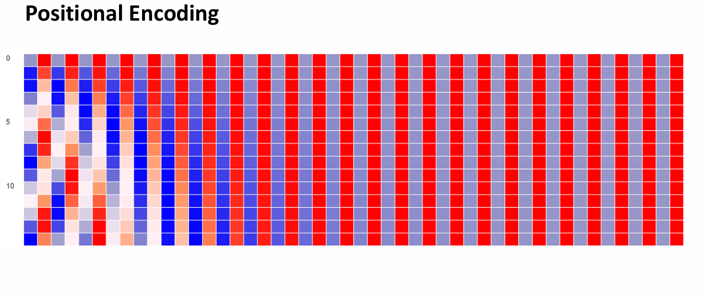
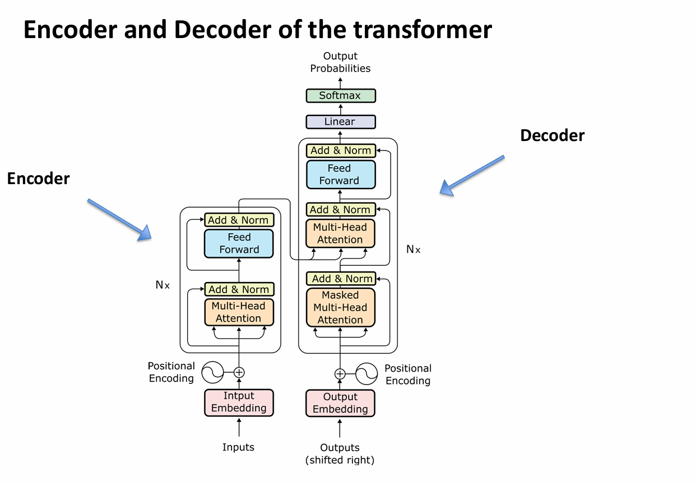

## Overview of Transformer Networks in Cybersecurity

### Introduction
The Transformer architecture, introduced in the seminal paper *"Attention Is All You Need"* (2017), represents the current state-of-the-art in deep learning. Unlike its predecessors, such as Recurrent Neural Networks (RNNs) and Long Short-Term Memory (LSTM) networks, Transformers eliminate sequential processing in favor of parallelization. This shift allows for the processing of massive datasets with high efficiency and the ability to capture "long-range dependencies"—relationships between data points that are far apart in a sequence.

### Core Mechanics

#### The Self-Attention Mechanism ($Q, K, V$)
The most significant innovation of the Transformer is the **Self-Attention mechanism**. Each input token produces three vectors:
*   **Query (Q):** What the token is looking for.
*   **Key (K):** What the token contains.
*   **Value (V):** The actual information the token carries.

The model calculates an attention score by comparing the Query of one token with the Keys of all others, determining how much "focus" to place on different parts of the sequence.

#### Positional Encoding
Because Transformers process all tokens simultaneously, they lack an inherent sense of order. To resolve this, **Positional Encodings** are added to the input embeddings. These are calculated using sine and cosine functions of different frequencies, creating a unique signature for every position in a sequence.

#### Mathematical Visualization
Below is a self-generated heatmap representing the sinusoidal positional encoding matrix. Each row represents a position in a sentence, and each column represents a dimension in the embedding space.


*Figure 1: Sinusoidal Positional Encoding heatmap generated via Python (see Code Breakdown section).*

#### Architecture Overview
The model consists of an **Encoder** (which reads and understands the input) and a **Decoder** (which generates the output). Both utilize **Multi-Head Attention**, allowing the model to focus on various types of relationships (e.g., syntax vs. semantics) at the same time.


*Figure 2: The standard Transformer architecture featuring Encoder/Decoder stacks.*

### Applications in Cybersecurity

The ability of Transformers to understand context and detect complex patterns makes them invaluable in modern cybersecurity:

1.  **Anomaly Detection in System Logs:** By treating system logs as a "language," Transformers (specifically models like BERT) can be trained on normal behavior. They can then identify sequences of events that deviate from the norm, flagging potential lateral movement or privilege escalation.
2.  **Malware Analysis:** Transformers can analyze the opcode sequences of binary files. Even if malware is obfuscated, the structural "intent" of the code remains detectable by the attention mechanism.
3.  **Advanced Phishing Detection:** Large Language Models (LLMs) based on Transformers excel at detecting the subtle linguistic cues of social engineering, identifying malicious emails that do not contain links or attachments but aim to deceive users.
4.  **Automated Vulnerability Research:** Transformers can scan source code to predict potential vulnerabilities (like buffer overflows) by understanding how data flows across complex, multi-file projects.

### Source Code and Logic Breakdown

To generate the positional encoding visualization in Figure 1, the following Python script was developed:

```python
import numpy as np
import matplotlib.pyplot as plt

def generate_pe_matrix(seq_len, d_model):
    # Initialize the matrix
    pe = np.zeros((seq_len, d_model))
    for pos in range(seq_len):
        for i in range(0, d_model, 2):
            # Applying the Sinusoidal formula from the Vaswani et al. paper
            pe[pos, i] = np.sin(pos / (10000 ** ((2 * i) / d_model)))
            if i + 1 < d_model:
                pe[pos, i + 1] = np.cos(pos / (10000 ** ((2 * i) / d_model)))
    return pe

# Parameters: 50 token sequence with 128 embedding dimensions
pe_matrix = generate_pe_matrix(50, 128)

# Visualization logic
plt.figure(figsize=(10, 6))
plt.pcolormesh(pe_matrix, cmap='RdBu')
plt.xlabel('Embedding Dimension')
plt.ylabel('Token Position')
plt.title('Generated Positional Encoding Heatmap')
plt.savefig('positional_encoding.png')
```
### Logic Breakdown
* ```pos``` **Loop:** Iterates through each word/token position in the sequence.
* ```i``` **Loop:** terates through the embedding dimensions
* **Sine/Cosine Functions:** Even indices use Sine and odd indices use Cosine. The denominator ```10000 ** ((2 * i) / d_model)``` ensures that different dimensions have different frequencies, allowing the model to learn to attend to relative positions easily.
* **Heatmap:** The resulting values between -1 and 1 create the unique wave pattern visible in Figure 1, serving as a "GPS" for the Transformer.