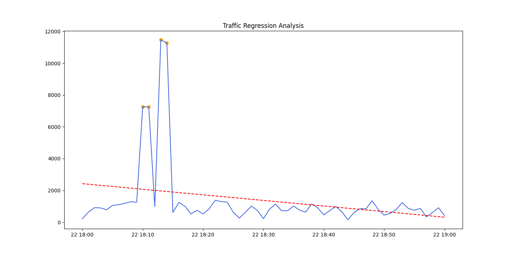

### Introduction
This report details the identification of a Distributed Denial of Service (DDoS) attack using regression analysis. By analyzing the frequency of web server requests over time, we established a mathematical baseline and identified statistical outliers that represent malicious activity.

### Dataset and Resources
The analysis was performed on the following server log file:
*   **Log File:** [server.log](./server.log)
*   **Analysis Script:** [ddos_analysis.py](./ddos_analysis.py)

### Methodology and Source Code Fragments
The analysis was conducted in three major phases using Python and the Scikit-Learn library.

#### Phase A: Log Parsing (Regex)
To extract the data, I used Regular Expressions to isolate the timestamp from each entry in the raw log file.
```python
# Extracting timestamps from the log format
match = re.search(r'\[(\d{4}-\d{2}-\d{2} \d{2}:\d{2}:\d{2})', line)
if match:
    log_data.append(match.group(1))
```
#### Phase B: Data Aggregation
The individual requests were resampled into 1-minute intervals to measure traffic density (Requests Per Minute).

```Python
# Grouping data into 1-minute windows
df_resampled = df.resample('1min', on='timestamp').count()
```
#### Phase C: Regression and Anomaly Detection
A Linear Regression model was fitted to the time-series data to predict the expected "normal" trend. Any traffic exceeding this prediction by 2 standard deviations was flagged as a DDoS attack.

```Python
# Linear Regression Model
X = np.arange(len(df_resampled)).reshape(-1, 1)
y = df_resampled['actual_count'].values
model = LinearRegression().fit(X, y)

# Detect anomalies (DDoS)
threshold = model.predict(X) + (2 * np.std(y))
ddos_events = df_resampled[df_resampled['actual_count'] > threshold]
```
### Identified DDoS Attack Intervals
The regression analysis identified a sustained attack occurring during the following intervals:

| Timestamp | Request Count  | Status |
|---------|----------------|----------|
| 2024-03-22 18:10:00 | 	7,263         |	Attack Detected |
| 2024-03-22 18:11:00 | 	7,245         |	Attack Detected |
| 2024-03-22 18:13:00 | 	11,468        | Peak Attack |
| 2024-03-22 18:14:00 | 	11,279        | Peak Attack |

### Visualization
The graph below visualizes the traffic spike. 
The red dashed line indicates the expected regression trend (normal behavior), while the orange points represent the statistically significant DDoS attack detected by the model.

### Conclusion
The regression analysis successfully isolated the DDoS attack. 
The massive jump to over 11,000 requests per minute represents a deviation that is statistically impossible within normal traffic patterns, confirming a successful detection.